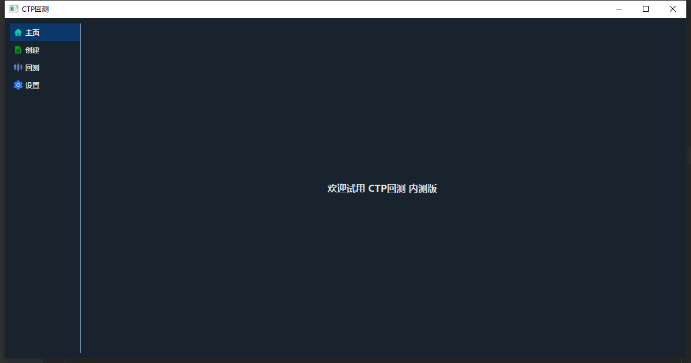
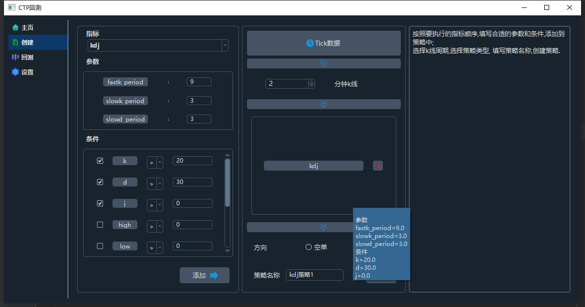
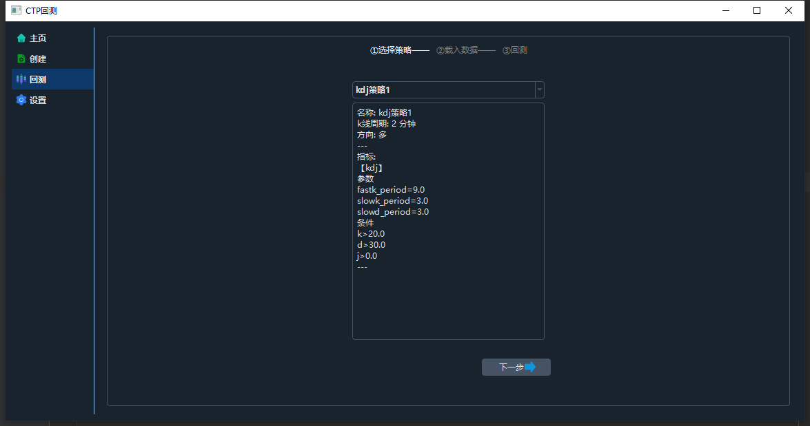
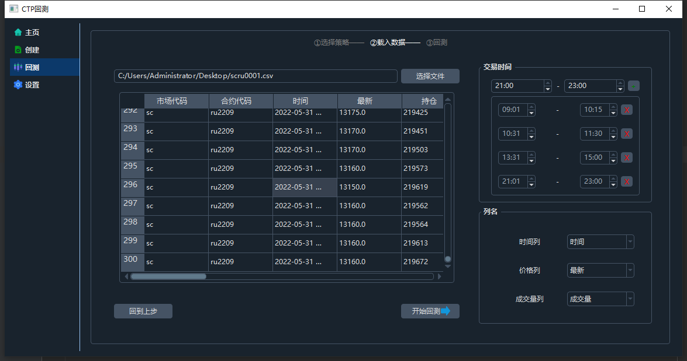
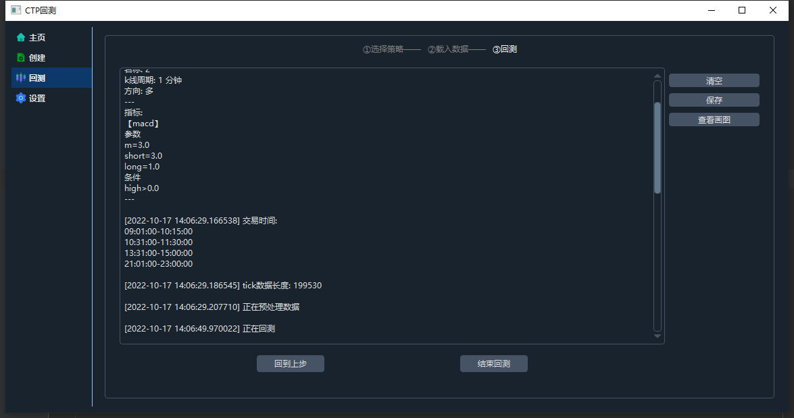
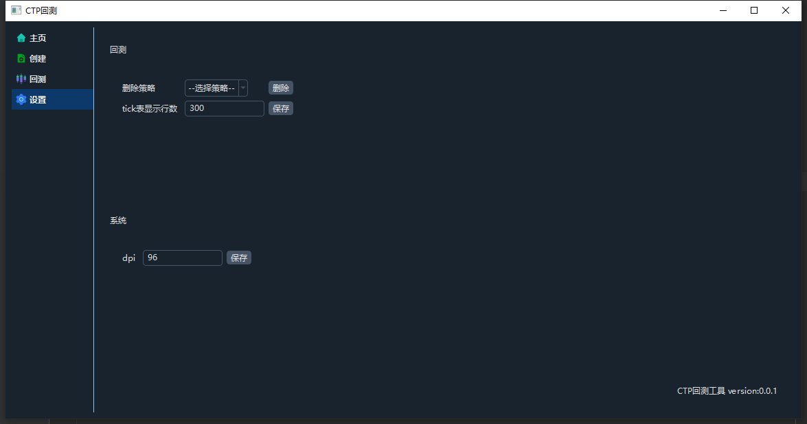

# CTP回测
>这是一个自定义CTP回测的项目, 允许用户通过手动添加的方式创建回测策略
---
update time: 2022-10-17
功能还需要完善
### 主页

### 创建策略

### 回测
选择策略

选择行情文件、交易时间

开始回测

### 设置

---
## \# ROADMAP
### stage1
> 实现中
> * 实现页面基本功能
> * 实现"根据默认选项, 创建基于单合约, 单执行策略的回测策略"的功能
### stage2
> 未实现
> * 实现"添加自定义选项作为默认选项"的功能
### stage3
> 未实现
> * 实现"单合约回测策略可以添加多个执行策略"的功能
### stage4
> 未实现
> * 实现"多合约联合回测"的功能